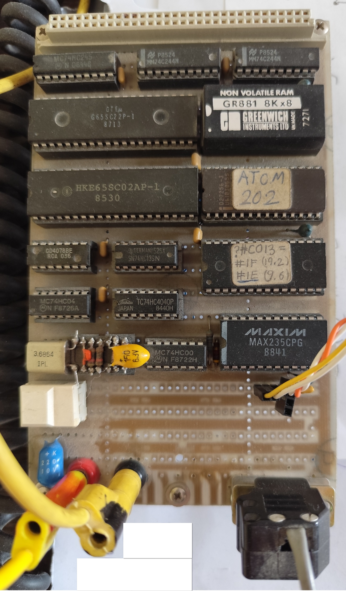

# Snake for the Acorn Atom

A classic snake game written in BBC BASIC for a modified Acorn Atom 6502 board
computer, featuring binary indexed tree-based food placement, VT100 terminal
graphics, and support for single and dual-player modes.




## The Acorn Atom

### Hardware

The target platform is a custom board computer built around the **MOS 6502**
8-bit CPU running at approximately 1 MHz. It is a modified Acorn Atom — a
British home computer from 1980. The system has **8 KB of RAM** total, of which
roughly 1,282 bytes are reserved for the BASIC interpreter workspace, leaving
about 6,910 bytes for program code and data combined.

BBC BASIC on the Atom imposes a **63-character line length limit**, restricts
variable names to single uppercase letters (A–Z), and provides only 26
integer/float variables plus a few dimensioned arrays. There is no structured
programming — control flow uses `GOTO`, `GOSUB`, and `IF...THEN` where a false
condition skips the entire remainder of the line.

### VT100 Terminal Modification

The original Acorn Atom had a built-in keyboard and composite TV output. This
variant replaces both with an **RS232 serial port** connected to a **VT100
terminal**. All screen rendering is done through ANSI escape sequences sent over
serial:

- **Cursor positioning** (`ESC[row;colH`) for direct cell updates without full
  redraws
- **Double-width** (`ESC#6`) and **double-height** (`ESC#3`/`ESC#4`) lines for
  the title and game grid — each grid cell occupies two terminal columns
- **Reverse video** (`ESC[7m`) for drawing the border walls
- **VT100 line-drawing characters** (`ESC(0` to activate) for rendering snake
  body segments as box-drawing glyphs (corners `┐┘┌└` for turns, lines `─│`
  for straight segments), selected via a 16-entry lookup table indexed by
  previous and current direction

Keyboard input is read through a 16-entry circular buffer at memory address
`#400`, polled non-blockingly during gameplay — essential for real-time control.

### Build Pipeline

The source files (`Snake.abp`, `AcornAtom.abp`) use C preprocessor macros for
readability — descriptive variable names, named constants, and structured
control flow macros that expand to raw BASIC. The build pipeline runs `cpp` to
expand macros, then `optimize.py` to strip whitespace, merge short lines,
evaluate constant expressions, and abbreviate keywords. The result compresses
from ~763 readable source lines to ~153 lines of optimized BASIC that fits
within the memory budget.

## Game Objectives

### Single Player

The player controls a snake on a bordered grid using numpad keys (4/6/8/2 for
left/right/up/down, with a phone-layout toggle). The snake moves continuously;
the player steers it to eat food items that appear on the board:

- **Mouse** (`@`): awards 1 point and grows the snake by one cell.
- **Bonus** (`*`): appears randomly in place of regular food. Its value depends
  on the current score — eating it when the last digit is 9 yields the maximum
  bonus (rounding up to the next ten), but when the last digit is low it can
  be worth nothing or even penalize. The AI exploits this: it ignores bonuses
  when the payoff is poor and prioritizes them at score endings of 9.

Five food items are present on the board at all times (replaced immediately
when eaten). If the snake eats all remaining food and the board is clear, the
game ends in **Win**. Hitting a wall or the snake's own body ends the game in
**Fail**. The highest score is tracked persistently across games, with separate
records for manual and AI play.

### Dual Player

Two snakes share the board — a primary snake (right side, heading east) and a
secondary snake (left side, heading west). Modes cycle through single-manual,
single-auto, dual manual+auto, and dual auto+auto. In dual mode the objective
is to **outlive the opponent**: when one snake crashes, the survivor wins. Both
snakes compete for the same food supply on the same board.

## Implementation

### Board Representation

The playable grid is stored in a byte array `G` of size `W × (H−2)` (width
times interior height, excluding the top and bottom border rows that are drawn
but not stored). Each byte encodes up to three pieces of information in its
lower bits:

| Bits | Meaning |
|------|---------|
| 0–1 | Direction (West=0, North=1, East=2, South=3) for snake segments, or food type (Mouse=1, Bonus=2) for food cells |
| 2 | Occupied flag — set for walls and snake body, clear for food and empty cells |

This encoding is compact (1 byte per cell) and exploits the fact that snake
segments always have bit 2 set (value ≥ 4) while food never does (value 1 or
2) and empty cells are zero. Collision detection is a single bit test. The
direction stored in each body segment forms a linked list: starting from the
tail, reading the direction of each cell and stepping in that direction leads
to the next segment toward the head. This chain is how the tail is retracted
when the snake moves without eating.

### The Binary Indexed Tree

#### The Problem

When food is eaten, a new piece must be placed on a random empty cell. The
naive approach — pick a random cell, check if empty, retry if occupied —
degrades as the board fills with snake body and walls. On a 40×20 grid with
800 cells, this becomes increasingly slow.

#### The Solution

A binary indexed tree stored in integer array `AA` tracks the **count of empty
cells** across regions of the board. It supports two operations in O(log n)
time:

- **Adjust**: when a cell changes state (empty ↔ occupied), update the count.
- **Locate**: given a random number k, find the k-th empty cell on the board.

To place food: generate a random number in `[0, totalEmpty)`, call Locate to
find that cell, done. Uniform distribution, no retries.

#### Array Layout

The tree has `O` nodes where `O = 2^k − 1` is the smallest such value
exceeding `gridSize / 10`. For a 40×20 board (800 cells), `O = 127`. The tree
is stored as a complete binary tree in array form:

```
         AA(0)           ← root: total empty cell count
        /      \
    AA(1)      AA(2)     ← each holds count for its half of the grid
    /   \      /   \
 AA(3) AA(4) AA(5) AA(6)
  ...
```

Node `i`'s children are at `2i+1` (left) and `2i+2` (right). Each interior
node's count equals the sum of its children. Leaf nodes each cover a range of
roughly `gridSize / leafCount ≈ 10` grid cells.

The tree is deliberately kept small — 127 nodes instead of 800 — to save
memory (508 bytes instead of 3,200). The trade-off is that Locate must do a
short linear scan (up to ~10 cells) after the binary phase narrows down to a
leaf's range, checking the `G` array to skip occupied cells. The result is
fast O(log O + ~10) lookup with minimal memory footprint.

#### Algorithms

**Adjust(cellIndex, delta):** Walk from root to leaf. At each level, add
`delta` (+1 or −1) to the current node, then descend left or right depending
on whether `cellIndex` falls in the lower or upper half of the current range.

**Locate(k):** Binary phase: starting at the root, compare `k` against the
left child's count. If `k < leftCount`, descend left; otherwise subtract
`leftCount` from `k` and descend right. This narrows to a leaf covering ~10
cells. Linear phase: scan those cells in the `G` array, skipping occupied ones,
counting down `k` empty cells until the target is found.

**Initialization:** The root is set to `gridSize` (all cells start empty).
Each level splits the parent's count roughly in half between children, with the
right child receiving the remainder on odd counts.

### Movement and Direction Encoding

Directions use a 2-bit encoding (West=0, North=1, East=2, South=3) designed
for efficient arithmetic. Turning is `(direction + turn) & 3`. Opposite
detection is `(d1 XOR d2) = 2`. The step calculation avoids branching entirely:

```
newPos = pos + (d&2 − 1) × ((d&1) × (width−1) + 1)
```

This single expression yields −1 (West), +width (South), +1 (East), or −width
(North).

### Dual Mode Implementation

Player state (head, tail, last direction, score) is swapped in and out of a
small auxiliary array (`GG`, 3 integers) via a swap routine. Each game tick
moves the primary snake first, swaps state, moves the secondary snake (always
AI-controlled), then swaps back. Both snakes coexist on the same board array
and tree — a crash by either ends the game with the survivor winning.

### Snake in action
- Auto mode on real VT100: https://www.youtube.com/watch?v=VGX-_36iDMQ
- Manual mode on VT100 emulator: https://www.youtube.com/watch?v=s2Q3cZxiXhA

## Resources
### Acorn Atom
- Wiki: https://en.wikipedia.org/wiki/Acorn_Atom
- Original: https://www.theoddys.com/acorn/acorn_system_computers/atom/atom.html
- Manual: https://www.theoddys.com/acorn/acorn_system_computers/atom/Atomic%20Theory%20and%20Practice.pdf
### VT100
- Wiki: https://en.wikipedia.org/wiki/VT100
- Commands: http://www.braun-home.net/michael/info/misc/VT100_commands.htm
